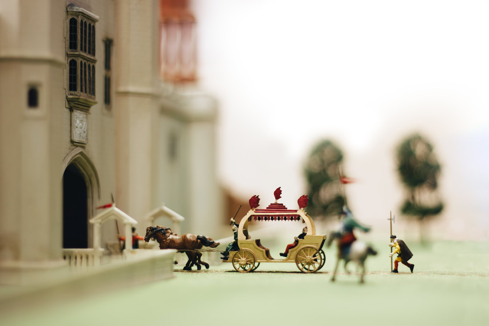

## News {#news}
The [Nonsuch Palace Gallery](/nonsuch-palace-model/) is now open every Sunday between 12pm and 4pm for those wishing to see the model. The [Service Wing Museum](/service-wing-museum/) has limited opening. Please see our [Opening Times](/opening-times/) page for further information.

We desperately need help in several areas - publicity, editing the newsletter and now a new Hon Secretary is sought. If you can help please contact the [Secretary](/contact-us/#secretary) to discuss possibilities, with absolutely no commitment.

## About Us {#about-us}
The Friends of Nonsuch is committed to preserving Nonsuch Park's history and its physical features. Our aim is to open up the Nonsuch Mansion and provide a history of the park for visitors. This website will explore the grounds of the park and give you a look into research projects as well as our museum and gallery. We will also provide all the relevant information to enable you to contact us and access our opening times.

The Friends of Nonsuch was formed in 1991 to fight for the preservation of the Nonsuch Park Estate as an open space accessible to all. Their successful campaign highlighted the need for conservation work on the Grade II* Listed Georgian Mansion House. Indeed the cost of renovations to the mansion house was a huge drain on council resources and one of the main reasons for the potential sale of the park and mansion house into private ownership. Since 1991 groups of volunteers have been restoring and providing support to conservation projects within the mansion.

For more about this charity then please see [About Us](/about-us/).

We would also love you to become a Member of the charity, you can do this by visiting our [Membership Page](/join-us/).

You can now find us on Twitter (X) under [@FoNonsuch](https://x.com/FoNonsuch).
​
## The Tudors - FREE Open Online Learning {#tudors}
The Nonsuch Palace model has been used by Roehampton University in a new MOOC - a Massive Open Online Course on The Tudors, through Future Learn. We are in good company with The Mary Rose and Hardwick Hall. The course can be found here.
​
## ​New Nonsuch Model Photos {#model}
One of our volunteers has been editing some new photos of the Nonsuch Palace Model - on display in the [Nonsuch Gallery](/nonsuch-palace-model/) - with the aim to show how the palace may have looked within its natural surroundings. We've been updating the website with a few of these new photos and hope they trigger your imagination into the splendour of the palace when it stood in Nonsuch, do come and visit us at Nonsuch Mansion, we'd love to show of the museum and gallery to you.

 {.mx-auto .w-screen .lg:w-5/6 .object-cover}
